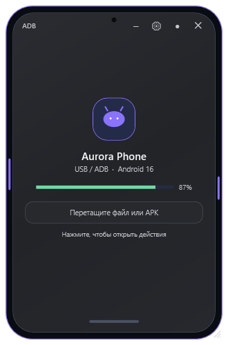
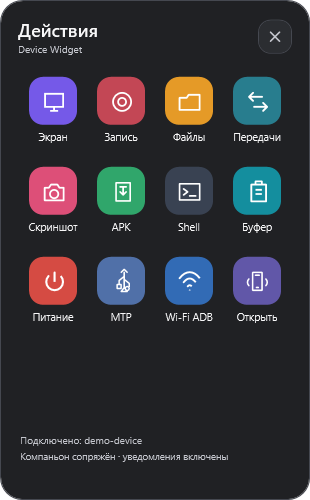
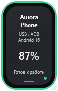
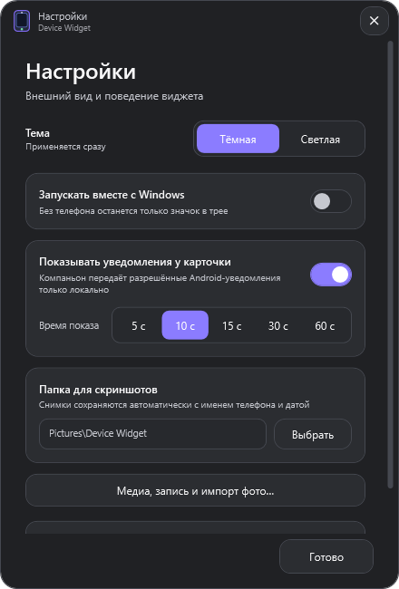
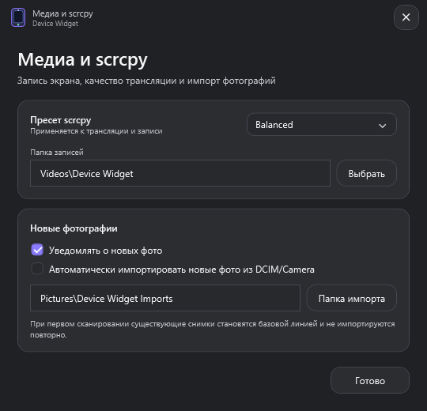
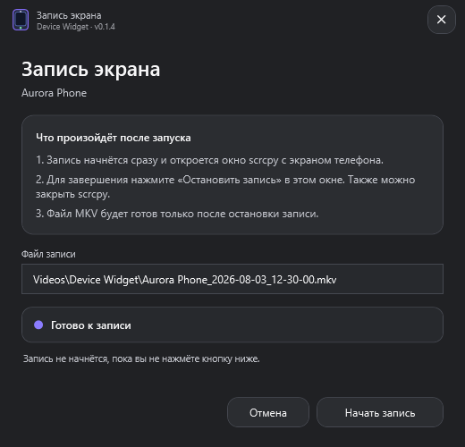
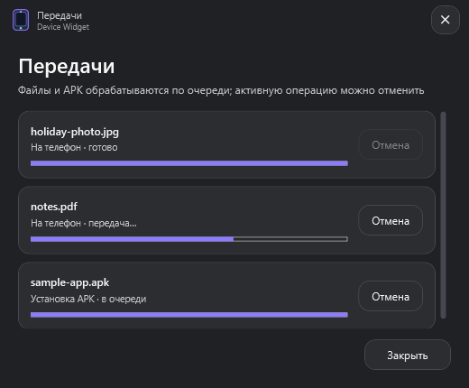
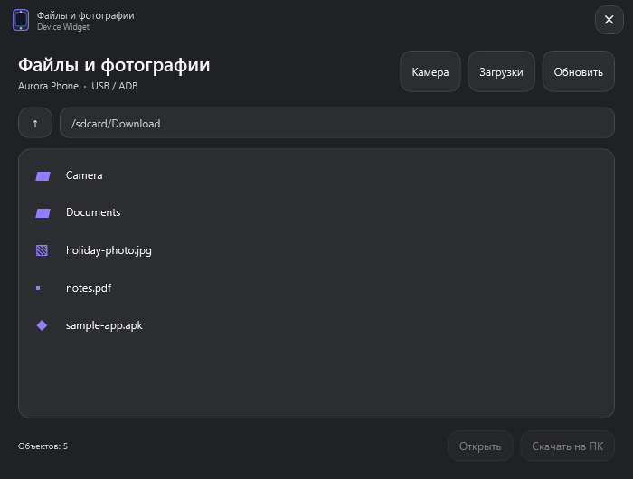
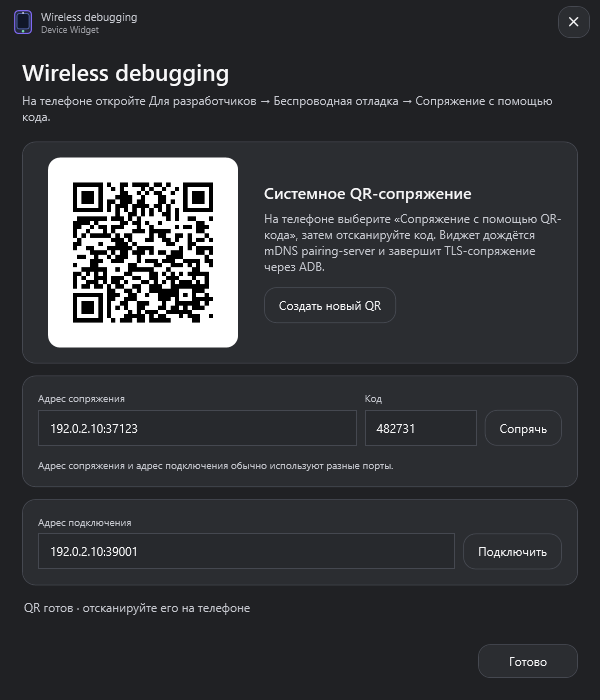
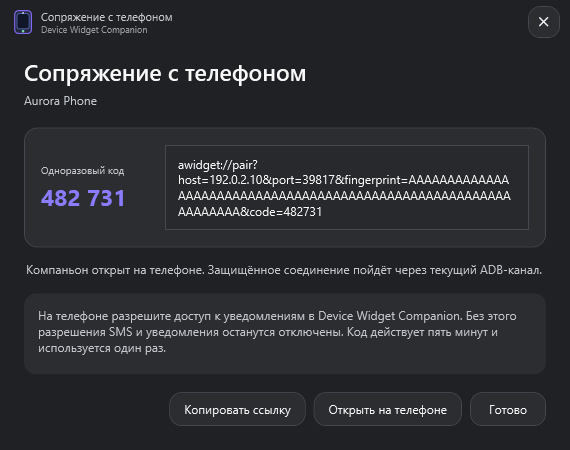

# Device Widget for Android™

Компактный desktop-виджет для управления подключёнными Android-устройствами.
Каждое устройство получает независимую карточку и собственный мини-виджет в
форме телефона. Приложение работает локально, не требует аккаунта и не содержит
телеметрию.

> Android is a trademark of Google LLC. Device Widget for Android is an
> independent project and is not affiliated with or endorsed by Google LLC.

## Возможности

- обнаружение всех устройств из `adb devices -l` и отдельное состояние окна для каждого;
- отображение состояний `online`, `offline`, `unauthorized`, блокировки и сна;
- передача файлов и папок перетаскиванием в `/sdcard/Download`;
- установка APK только после явного действия пользователя;
- трансляция и запись экрана через scrcpy 4.0;
- ADB-браузер файлов, скачивание на компьютер и переход к MTP;
- скриншоты и записи в выбранные пользователем папки;
- Wireless debugging по системному QR-коду или шестизначному коду;
- очередь передач с прогрессом и отменой;
- обнаружение новых фотографий и опциональный автоматический импорт;
- светлая и тёмная темы, автозапуск, трей и изменяемый размер карточек;
- стек до пяти уведомлений-баблов с настраиваемым временем показа;
- опциональный companion для защищённой локальной передачи разрешённых
  пользователем уведомлений;
- определение устаревшей версии companion и обновление после подтверждения.

Companion не устанавливается автоматически. Установка, подтверждение ADB,
сопряжение и системный доступ к уведомлениям выполняются только по явному
действию пользователя. Обновление также требует подтверждения в desktop-виджете
и, если этого требует Android, на телефоне. Приложение не запрашивает разрешения
на звонки, контакты и телефонные идентификаторы.

## Интерфейс

Снимки созданы из интерфейса приложения на демонстрационных данных. В них нет
серийных номеров, путей и идентификаторов реальных устройств.

| Карточка устройства | Меню действий | Мини-виджет |
|---|---|---|
|  |  |  |

| Основные настройки | Медиа и scrcpy | Запись экрана |
|---|---|---|
|  |  |  |

| Очередь передач | Файлы и фотографии |
|---|---|
|  |  |

| Wireless debugging | Сопряжение companion |
|---|---|
|  |  |

## Платформы

| Платформа | Архитектуры | Интерфейс | ADB и scrcpy |
|---|---|---|---|
| Windows 10/11 | x64, ARM64 | WPF-виджет | входят в release-пакет |
| macOS 14+ | Intel, Apple Silicon | Avalonia desktop host | используются из `PATH` |
| Linux | x64, ARM64 | Avalonia desktop host | используются из `PATH` |
| Android 8.0+ | companion APK | сопряжение и статус соединения | не требуются |

macOS и Linux используют общий Avalonia desktop host. `adb` и `scrcpy` на этих
платформах устанавливаются системным пакетным менеджером.

## Настройка телефона

1. Включите режим разработчика и USB debugging.
2. Подключите телефон и подтвердите RSA-отпечаток компьютера на его экране.
3. Для беспроводного подключения откройте плитку **Wi-Fi ADB** и следуйте
   системному экрану Wireless debugging на телефоне.
4. Для передачи уведомлений установите companion из карточки, создайте сеанс
   сопряжения и отдельно разрешите приложению доступ к уведомлениям.

Статус `unauthorized` означает, что RSA-подтверждение ещё не принято на
телефоне. Карточки привязаны к ADB serial только во время выполнения; значения
конкретных устройств не зашиты в приложение.

## Запуск из исходников

Требования: .NET 8 SDK, Windows 10/11 и Android Platform Tools либо встроенный
архив scrcpy.

```powershell
git clone https://github.com/kavabunga6/device-widget-for-android.git
cd device-widget-for-android
dotnet restore AndroidWidget.csproj
dotnet run --project AndroidWidget.csproj
```

Avalonia desktop host:

```powershell
dotnet run --project src/AndroidWidget.Desktop/AndroidWidget.Desktop.csproj
```

Android companion:

```powershell
cd companion-android
./gradlew.bat lint test assembleDebug
```

## Локальные данные

Все рабочие пути вычисляются через системные API. Исходный код и конфигурация
не содержат абсолютных путей разработчика.

| Данные | Расположение |
|---|---|
| Настройки | `%LOCALAPPDATA%\AndroidWidget\settings.json` |
| Диагностический лог | `%LOCALAPPDATA%\AndroidWidget\widget.log` |
| Распакованный scrcpy | `%LOCALAPPDATA%\AndroidWidget\scrcpy\v4.0` |
| Скриншоты | выбранная папка; по умолчанию `Изображения\Device Widget` |
| Записи | выбранная папка; по умолчанию `Видео\Device Widget` |
| Импорт фото | выбранная папка; по умолчанию `Изображения\Device Widget Imports` |

`AndroidWidget` используется как совместимый внутренний идентификатор каталога
данных. Диагностический лог может содержать локальные пути из сообщений
операционной системы, поэтому его следует проверить перед публикацией.

Подробнее: [политика приватности](PRIVACY.md) и
[модель companion](docs/COMPANION.md).

## Проверка и release-сборка

```powershell
dotnet build AndroidWidget.csproj -c Release -warnaserror
dotnet format AndroidWidget.csproj --verify-no-changes
dotnet build src/AndroidWidget.Desktop/AndroidWidget.Desktop.csproj -c Release -warnaserror
dotnet run --project AndroidWidget.csproj -c Release -- --verify-scrcpy-bundle
dotnet run --project AndroidWidget.csproj -c Release -- --verify-sms-parser
dotnet run --project AndroidWidget.csproj -c Release -- --verify-companion-bundle
dotnet run --project AndroidWidget.csproj -c Release -- --verify-wireless-qr
```

Windows-этап создаёт Windows x64/ARM64, подписанный companion APK, контрольные
суммы и архивы corresponding source:

```powershell
$env:DEVICE_WIDGET_ANDROID_KEYSTORE = 'path-to-release.jks'
$env:DEVICE_WIDGET_ANDROID_STORE_PASSWORD = '<from-local-secret-store>'
$env:DEVICE_WIDGET_ANDROID_KEY_ALIAS = 'release-alias'
$env:DEVICE_WIDGET_ANDROID_KEY_PASSWORD = '<from-local-secret-store>'
./tools/build_release.ps1 -Version 0.1.6
```

macOS-пакеты собираются только нативно на macOS, чтобы сохранить исполняемые права,
создать `.icns`, проверить `Info.plist` и выполнить ad-hoc signing:

```bash
./tools/build_macos_bundle.sh 0.1.6 osx-arm64 artifacts/packages
./tools/build_macos_bundle.sh 0.1.6 osx-x64 artifacts/packages
```

Linux-пакеты также собираются нативно, чтобы сохранить исполняемые права:

```bash
./tools/build_linux_package.sh 0.1.6 linux-x64 artifacts/packages
./tools/build_linux_package.sh 0.1.6 linux-arm64 artifacts/packages
```

Те же процессы автоматизированы workflows **macOS Packages** и **Linux Packages**.

Ключи и пароли не хранятся в репозитории. Статус подписи каждого пакета указан
в release notes.

## Лицензии и corresponding source

Код проекта распространяется по [Apache License 2.0](LICENSE). Полный перечень
зависимостей, версий, уведомлений об авторских правах и лицензий находится в
[THIRD_PARTY_NOTICES.md](THIRD_PARTY_NOTICES.md). Условия и контрольные суммы
точных исходников FFmpeg 8.1.1 и libusb 1.0.29 описаны в
[SOURCE_OFFER.md](SOURCE_OFFER.md).

Release-пакеты содержат `LICENSE`, `THIRD_PARTY_NOTICES.md`, `SOURCE_OFFER.md`,
каталог `licenses/` и соответствующие LGPL-исходники. Те же основные тексты
встроены в companion APK и доступны через пункт **Лицензии и сторонние
компоненты**.

Встроенный scrcpy используется без изменений, а официальный Windows-архив
проверяется по закреплённому SHA-256. FFmpeg связан динамически и собран без
GPL-only опций; точные configure flags находятся в исходном архиве scrcpy 4.0.

## Структура проекта

```text
AndroidWidget.csproj                  Windows WPF composition root
src/AndroidWidget.Core/               модели и независимые контракты
src/AndroidWidget.Infrastructure/     ADB, scrcpy, настройки и интеграции
src/AndroidWidget.Protocol/           versioned companion protocol
src/AndroidWidget.CompanionHost/      WSS host, pairing and tokens
src/AndroidWidget.Desktop/            Avalonia host for macOS/Linux/Windows
companion-android/                     optional Android companion
licenses/                              shipped license texts and notices
third_party/sources/                   corresponding-source manifest
tools/build_release.ps1               reproducible release packaging
tools/build_macos_bundle.sh           native macOS bundle, icon, signing and verification
tools/build_linux_package.sh          native Linux packaging and executable-mode verification
tools/DocsCapture/                     reproducible documentation screenshots
```

Архитектура описана в [ARCHITECTURE.md](ARCHITECTURE.md).

## Security

Уязвимости следует сообщать через GitHub Private Vulnerability Reporting, а не
публичный issue. Подробности: [SECURITY.md](SECURITY.md).
