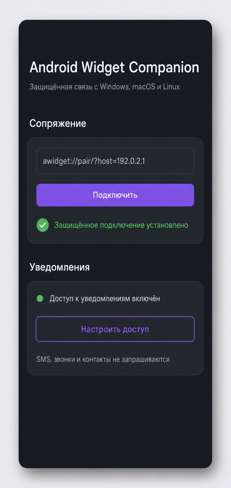

# Android Device Widget

> Companion Host теперь встроен в основной Windows-виджет. После подтверждённой
> установки APK открывается на телефоне, а плитка **Сопрячь** создаёт и показывает
> одноразовую ссылку и одновременно передаёт её выбранному телефону через ADB.
> Баблы Android-уведомлений включаются только после сопряжения и явного разрешения Android на
> доступ к уведомлениям.

Компактный настольный виджет для управления Android-устройствами через ADB. Каждое подключённое устройство получает собственную карточку: большую или свёрнутую мини-карточку. Файлы можно отправлять на телефон перетаскиванием, APK — устанавливать тем же способом, а экран — просматривать и управлять им через встроенный scrcpy.

> Полнофункциональный ADB-виджет выпускается для **Windows x64 и ARM64**. Общий desktop-host на Avalonia также собирается для macOS и Linux; различия платформ перечислены ниже.

## Интерфейс

На скриншотах используются только обезличенные демонстрационные данные.

| Мини-виджет устройства | Меню действий |
|---|---|
|  |  |

### Android-компаньон

| Приложение на телефоне | Сопряжение на компьютере |
|---|---|
|  |  |

## Кроссплатформенный companion preview

Новая ветка не зависит от Phone Link и не использует ID, пути или учётные данные конкретного компьютера. Android-приложение соединяется с desktop-host напрямую в локальной сети по WSS, проверяет SHA-256 fingerprint сертификата и после одноразового шестизначного кода хранит выданный токен в Android Keystore.

Сейчас реализованы:

- отдельная запись для каждого сопряжённого телефона без подмены другим устройством;
- модель, версия Android, заряд, состояние экрана и блокировки;
- передача разрешённых пользователем Android-уведомлений и стек до пяти сообщений у нужной карточки;
- автоматическое переподключение foreground-service;
- одноразовое сопряжение по ссылке `awidget://pair`;
- desktop UI на Avalonia 12 для Windows, macOS и Linux;
- отсутствие разрешений на звонки, SMS, контакты и телефонные идентификаторы.
- отдельная плитка установки в карточке телефона: companion никогда не ставится автоматически;
- отключённое состояние companion-функций, пока пакет не установлен на конкретном устройстве.

APK находится в проекте `companion-android`, desktop-клиент — в `src/AndroidWidget.Desktop`. Сборка, протокол, модель угроз и текущие ограничения подробно описаны в [документации companion](docs/COMPANION.md).

Установка с основной Windows-карточки требует трёх явных действий пользователя: открыть меню телефона, нажать **Компаньон** и подтвердить диалог. Системный доступ к уведомлениям после установки также выдаётся отдельно на самом телефоне. Отмена диалога не запускает `adb install`; если пользователь решит установить companion позже, кнопка останется доступной.

## Возможности

- автоматическое обнаружение всех устройств из `adb devices -l`;
- отдельная мини-карточка для каждого одновременно подключённого телефона;
- определение производителя, модели, маркетингового имени, версии Android, разрешения экрана и заряда батареи;
- визуальный скин корпуса по модели или производителю с нейтральным резервным вариантом;
- индикация состояний `online`, `offline` и `unauthorized`;
- отдельные красные индикаторы блокировки и выключенного/спящего экрана;
- большая карточка с быстрыми действиями и компактный режим с названием телефона;
- контекстное меню действий по правому клику на мини-карточке;
- передача файлов и папок в `/sdcard/Download` через drag-and-drop;
- автоматическая установка перетащенных APK через `adb install -r`;
- общая очередь загрузок, скачиваний и установки APK с прогрессом и отменой;
- встроенный файловый браузер для `/sdcard`, камеры и загрузок;
- скачивание, открытие и перетаскивание файлов из ADB-браузера на компьютер;
- создание PNG-скриншота с автоматическим именем в выбранной папке;
- трансляция, запись экрана в MKV и пресеты качества/задержки встроенного scrcpy 4.0;
- системное Wireless debugging: QR-сопряжение через `WIFI:T:ADB`, mDNS и TLS, а также pairing по шестизначному коду;
- обнаружение новых фотографий в `DCIM/Camera`, уведомления и опциональный автоматический импорт;
- локальный стек до пяти всплывающих баблов Android-уведомлений рядом с карточкой нужного устройства;
- отправка текста из буфера обмена, запуск ADB shell и переключение питания экрана;
- открытие устройства в системном проводнике для MTP-подключений;
- светлая и тёмная темы;
- изменение размера большой и мини-карточек за правый нижний угол с адаптацией содержимого;
- режим «поверх всех окон», запоминание позиции и состояния карточки;
- автозапуск вместе с Windows;
- работа через системный трей: если устройств нет, на экране остаётся только значок в трее;
- общий Avalonia UI для companion и основных ADB-действий на Windows, macOS и Linux.

## Как это работает

```text
Android-устройство ── USB/Wi-Fi ADB ── Android Device Widget
                                             ├─ карточка устройства
                                             ├─ передача файлов / установка APK
                                             ├─ файловый браузер / скриншоты
                                             └─ встроенный scrcpy
```

Виджет опрашивает локальный ADB-сервер и не обращается к внешним API. Статические сведения об устройстве кэшируются в памяти процесса. Для каждой найденной серийной записи создаётся отдельное окно мини-карточки; раскрытие одного устройства не скрывает карточки остальных.

## Требования

Для готовой сборки:

- Windows 10 или Windows 11, x64;
- .NET 8 Desktop Runtime;
- Android-устройство с включённой отладкой по USB либо настроенной беспроводной отладкой;
- USB-драйвер производителя, если Windows не распознаёт ADB-интерфейс.

Устанавливать ADB или scrcpy отдельно не требуется: официальный portable-пакет scrcpy 4.0 для Windows вместе с ADB встроен в приложение.

Для сборки из исходников дополнительно нужен .NET 8 SDK.

## Первый запуск и подключение

1. На телефоне откройте **Настройки → Для разработчиков** и включите **Отладку по USB**.
2. Подключите телефон к компьютеру и выберите USB-режим, позволяющий использовать данные.
3. Запустите `AndroidWidget.exe`.
4. При первом подключении подтвердите на телефоне RSA-ключ этого компьютера. Пока подтверждения нет, карточка показывает состояние авторизации.
5. Если карточка не появилась, проверьте драйвер и вывод `adb devices -l`.

Для беспроводного подключения сначала выполните стандартное сопряжение ADB (`adb pair` / `adb connect`). После появления сетевого serial в списке ADB виджет обработает его так же, как USB-устройство.

## Управление

### Большая карточка

- нажмите кнопку сворачивания, чтобы перейти в мини-режим;
- перетащите APK на карточку для установки;
- перетащите обычный файл или папку для копирования в `Download` на телефоне;
- используйте кнопки для файлов, scrcpy, скриншота, shell, буфера обмена и питания;
- откройте настройки, чтобы сменить тему или включить автозапуск.

### Мини-карточка

- показывает модель, краткий serial, заряд и состояние подключения;
- левый клик раскрывает соответствующее устройство;
- правый клик открывает компактное меню тех же основных действий;
- drag-and-drop работает так же, как на большой карточке;
- новые Android-уведомления собираются в стек до пяти баблов именно у карточки нужного телефона; каждый бабл закрывается отдельно нажатием или автоматически;
- карточку можно перемещать независимо от остальных устройств.
- карточку можно пропорционально уменьшать и увеличивать за правый нижний угол.

### Состояния устройства

| Индикация | Значение | Что сделать |
|---|---|---|
| Обычная карточка | Устройство доступно | Действия ADB разрешены |
| Янтарное предупреждение | `unauthorized` | Разблокировать телефон и подтвердить RSA-ключ |
| Красный замок | Телефон заблокирован | Разблокировать телефон |
| Красная кнопка питания | Экран выключен или устройство спит | Включить экран кнопкой на карточке или телефоне |
| `offline` | ADB видит serial, но сеанс недоступен | Переподключить кабель/Wi-Fi и перезапустить ADB |

Определение блокировки основано на `dumpsys power` и `dumpsys window policy`. Формат этих данных различается между прошивками, поэтому на некоторых моделях возможна только приблизительная индикация.

## Файлы и скриншоты

- обычные файлы и папки отправляются в `/sdcard/Download`;
- APK устанавливаются с флагом `-r`, то есть существующее приложение обновляется с сохранением данных, если Android это разрешает;
- скачанные через браузер файлы сохраняются в `%USERPROFILE%\Downloads\Android Widget`;
- файлы, открытые непосредственно из браузера, сначала копируются во временную папку `%TEMP%\AndroidWidget`;
- папка для скриншотов выбирается в настройках; по умолчанию используется `Изображения\Android Widget`;
- имя формируется автоматически из модели телефона и времени снимка.

### Очередь передач

Перетаскивание на большую или мини-карточку больше не блокирует виджет. Каждый файл, папка или APK получает отдельную задачу. Окно **Передачи** показывает направление, состояние и процент, когда ADB сообщает прогресс. Активную и ожидающую задачу можно отменить; отмена завершает соответствующий процесс ADB и не затрагивает остальные устройства.

В ADB-браузере файл можно потянуть из списка в Explorer или другое приложение. Первая попытка подготавливает локальную временную копию; если кнопка мыши уже отпущена, достаточно сразу перетащить тот же элемент повторно.

### Wireless debugging

Кнопка **Wi-Fi ADB** поддерживает два системных сценария Android 11+:

1. QR: открыть на телефоне **Для разработчиков → Беспроводная отладка → Сопряжение с помощью QR-кода**, создать QR в виджете и отсканировать его.
2. Код: выбрать на телефоне сопряжение с помощью кода, ввести pairing-адрес и шесть цифр, затем отдельно указать адрес подключения из основного экрана Wireless debugging.

Pairing-порт и connect-порт обычно различаются. QR-сценарий ждёт объявление `_adb-tls-pairing._tcp` через mDNS и не отправляет секрет за пределы локальной сети.

### Запись и новые фотографии

- кнопка **Запись** запускает scrcpy с сохранением MKV; закрытие окна scrcpy завершает файл;
- пресеты `Balanced`, `Quality`, `LowLatency` и `Presentation` меняют разрешение, битрейт, FPS и задержку;
- папка записей задаётся в **Настройки → Медиа, запись и импорт фото**;
- новые файлы в `/sdcard/DCIM/Camera` определяются с существующими фотографиями в качестве базовой линии;
- уведомления и автоматический импорт включаются независимо, а импорт раскладывает файлы по папкам с обезличенным безопасным именем устройства.

## Локальные данные и приватность

Приложение не содержит телеметрии, аналитики, облачной синхронизации или сетевых запросов к сторонним сервисам. Оно запускает только локальные процессы ADB/scrcpy и стандартные компоненты Windows.

Для SMS-баблов виджет определяет пакет, которому Android выдал системную роль `SMS`, и локально читает только его активные уведомления через `dumpsys notification`. Текст не записывается в настройки или лог. Одновременно показывается не более пяти баблов, а длительность показа каждого выбирается в настройках: 5, 10, 15, 30 или 60 секунд; значение по умолчанию — 10 секунд. Существующие уведомления при запуске используются как базовая линия и повторно не показываются. Функцию можно отключить в настройках.

Локальные данные хранятся в профиле текущего пользователя и вычисляются через системные API — абсолютных путей конкретного разработчика в коде нет:

| Данные | Расположение |
|---|---|
| Настройки | `%LOCALAPPDATA%\AndroidWidget\settings.json` |
| Диагностический лог | `%LOCALAPPDATA%\AndroidWidget\widget.log` |
| Распакованный scrcpy | `%LOCALAPPDATA%\AndroidWidget\scrcpy\v4.0` |
| Записи экрана | выбранная папка; по умолчанию `Видео\Android Widget` |
| Автоимпорт фотографий | выбранная папка; по умолчанию `Изображения\Android Widget Imports` |
| Временно открытые файлы | `%TEMP%\AndroidWidget` |
| Автозапуск | `HKCU\Software\Microsoft\Windows\CurrentVersion\Run` |

Лог содержит технические события запуска и тексты необработанных исключений. Перед отправкой лога третьим лицам стоит просмотреть его: сообщение ОС может включать локальный путь к файлу, с которым выполнялась операция.

## Готовые сборки

Архивы публикуются на странице [GitHub Releases](../../releases/latest). Все desktop-пакеты self-contained: отдельно устанавливать .NET не требуется.

| Платформа | Архитектуры | Интерфейс | ADB и scrcpy |
|---|---|---|---|
| Windows 10/11 | x64 | Полная карточка WPF | Встроены |
| Windows 11 | ARM64 | Полная карточка WPF | Встроенный x64-пакет запускается через системную эмуляцию |
| macOS 10.15+ | Intel x64, Apple Silicon | Общий Avalonia UI | Требуются в `PATH` |
| Linux | x64, ARM64 | Общий Avalonia UI | Требуются в `PATH` |
| Android 8.0+ | APK-компаньон | Экран сопряжения и уведомления | Не требуются |

В Windows-архивах находятся `AndroidWidget.exe` и краткая инструкция. macOS-пакет содержит `Android Widget.app`, Linux-пакет — исполняемый файл `AndroidWidget`. В TAR.GZ сохранён executable-bit, но при ручном копировании Linux-файла его можно вернуть командой `chmod +x AndroidWidget`.

Локальные тестовые сборки не подписаны коммерческими сертификатами Windows и Apple и не проходят Apple notarization. APK версии `0.1.0` подписан Android Debug certificate и предназначен для тестирования; для публичного стабильного выпуска понадобится постоянный release-ключ, который не хранится в репозитории.

Рядом с файлами релиза публикуется `SHA256SUMS.txt`. Проверка загруженного файла:

```powershell
Get-FileHash .\AndroidWidget-0.1.0-windows-x64.zip -Algorithm SHA256
```

```bash
sha256sum AndroidWidget-0.1.0-linux-x64.tar.gz
```

## Запуск из исходников

```powershell
git clone <repository-url>
cd android-device-widget
dotnet restore AndroidWidget.csproj
dotnet run --project AndroidWidget.csproj
```

При запуске через `dotnet run` функция автозапуска недоступна: она требует опубликованный EXE, путь к которому можно сохранить в реестре.

## Сборка

Проверка Release-конфигурации:

```powershell
dotnet build AndroidWidget.csproj -c Release -warnaserror
dotnet format AndroidWidget.csproj --verify-no-changes
dotnet run --project AndroidWidget.csproj -c Release -- --verify-scrcpy-bundle
dotnet run --project AndroidWidget.csproj -c Release -- --verify-sms-parser
dotnet run --project AndroidWidget.csproj -c Release -- --verify-companion-bundle
dotnet run --project AndroidWidget.csproj -c Release -- --verify-wireless-qr
```

Self-contained сборка Windows x64:

```powershell
dotnet publish AndroidWidget.csproj `
  -c Release `
  -r win-x64 `
  --self-contained true `
  -p:PublishSingleFile=true `
  -p:IncludeNativeLibrariesForSelfExtract=true `
  -p:EnableCompressionInSingleFile=true `
  -o artifacts/publish/windows-x64
```

Кроссплатформенный Avalonia-host публикуется из `src/AndroidWidget.Desktop`. Поддерживаемые RID: `osx-x64`, `osx-arm64`, `linux-x64` и `linux-arm64`:

```powershell
dotnet publish src/AndroidWidget.Desktop/AndroidWidget.Desktop.csproj `
  -c Release `
  -r osx-arm64 `
  --self-contained true `
  -p:PublishSingleFile=true `
  -p:IncludeNativeLibrariesForSelfExtract=true `
  -p:EnableCompressionInSingleFile=true `
  -o artifacts/publish/macos-arm64
```

Android-компаньон:

```powershell
cd companion-android
.\gradlew.bat --no-daemon lintDebug testDebugUnitTest assembleDebug
```

Результаты сборки складываются в `artifacts/`, который исключён из Git. В репозиторий и коммит release-бинарники не попадают — они прикладываются непосредственно к GitHub Release.

Встроенный архив scrcpy увеличивает размер EXE. Файл `vendor/scrcpy-win64-v4.0.zip` намеренно хранится в репозитории как исходный компонент сборки и не является результатом компиляции.

## Структура проекта

```text
src/AndroidWidget.Core/             модели и платформо-независимые контракты
src/AndroidWidget.Infrastructure/   ADB, scrcpy, JSON, лог и Windows-адаптеры
Composition/AppServices.cs          composition root и граф зависимостей
Presentation/                       tray и UI-модели
Models/PhoneSkin.cs                 WPF-правила выбора скина телефона
Services/ThemeService.cs            переключение ресурсов темы
App.xaml(.cs)                       жизненный цикл и координация окон по serial
MainWindow.xaml(.cs)                большая карточка и монитор устройств
DeviceMiniWindow.xaml(.cs)          независимая мини-карточка устройства
RemoteFilesWindow.xaml(.cs)         браузер файлов телефона
SettingsWindow.xaml(.cs)            настройки приложения
vendor/                             официальный архив scrcpy и его лицензия
```

Направление зависимостей и правила добавления новых функций описаны в [ARCHITECTURE.md](ARCHITECTURE.md). Конкретные сервисы создаются только в composition root; окна получают интерфейсы через конструкторы.

## Диагностика

Если устройство не появляется:

```powershell
adb kill-server
adb start-server
adb devices -l
```

- пустой список обычно означает проблему с кабелем, USB-режимом или драйвером;
- `unauthorized` означает, что RSA-запрос ещё не подтверждён на телефоне;
- `offline` часто исправляется переподключением устройства или перезапуском ADB;
- при проблемах самого виджета проверьте `%LOCALAPPDATA%\AndroidWidget\widget.log`.

Если scrcpy не запускается, удалите `%LOCALAPPDATA%\AndroidWidget\scrcpy\v4.0`: при следующем запуске пакет будет извлечён заново из EXE.

## Известные ограничения

- полнофункциональная карточка, трей, реестр, Explorer и `cmd.exe` остаются Windows-интеграциями;
- MTP-кнопка сопоставляет карточку с portable-объектом Windows по модели и открывает корень конкретного телефона; для этого на Android должен быть выбран USB-режим «Передача файлов (MTP)»;
- Android может запрещать установку APK, чтение отдельных папок или ввод текста политиками безопасности;
- SMS-бабл появляется, только если системное SMS-приложение создало уведомление с доступным заголовком и текстом; скрытое или отключённое уведомление прочитать нельзя;
- отправка SMS и ответ непосредственно из бабла пока не реализованы;
- некоторые символы в отправляемом через `adb shell input text` тексте поддерживаются не всеми версиями Android;
- распознавание модели и состояния экрана зависит от данных, которые предоставляет конкретная прошивка.

Avalonia preview в `src/AndroidWidget.Desktop` уже предоставляет общий UI companion-host, обнаружение ADB-устройств, передачу файлов, скриншоты, scrcpy/запись и Wireless debugging. На macOS/Linux он пока использует `adb` и `scrcpy` из `PATH`; встроенный portable-архив и системные интеграции основной карточки предназначены для `win-x64`.

## Сторонние компоненты

В приложение встроен [scrcpy 4.0](https://github.com/Genymobile/scrcpy/releases/tag/v4.0) от Genymobile вместе с Android Platform Tools из официального portable-пакета scrcpy для Windows. scrcpy распространяется по Apache License 2.0; копия текста лицензии находится в `vendor/scrcpy-LICENSE.txt` и извлекается рядом с portable-компонентом.

QR-коды Wireless debugging генерируются библиотекой [QRCoder 1.8.0](https://www.nuget.org/packages/QRCoder/1.8.0), распространяемой по лицензии MIT.
Payload и mDNS-поток соответствуют официальному описанию [ADB Wi-Fi architecture](https://android.googlesource.com/platform/packages/modules/adb/+/HEAD/docs/dev/adb_wifi.md).

SHA-256 встроенного архива `vendor/scrcpy-win64-v4.0.zip`:

```text
75DBEB5B00E6F64292F26F70900AE55CA397786BDFB0B9BBEB481A0549047457
```
